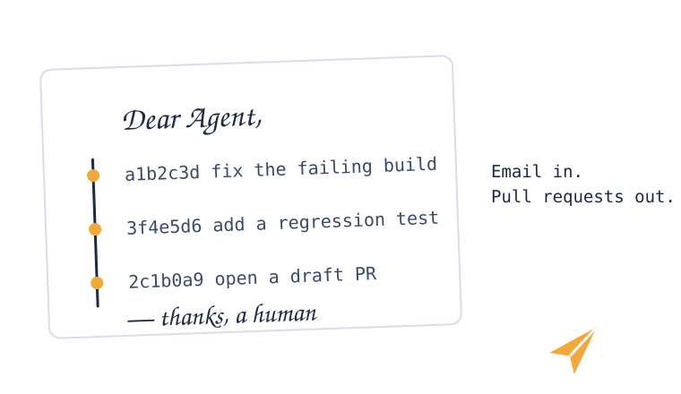

<p align="center">
  
</p>

<h1 align="center">Dear Agent</h1>

<p align="center"><strong>An async, email-first inbox that turns messages into Git pull requests produced by coding agents.</strong></p>

<p align="center">
  <a href="https://github.com/rarguello/dear-agent/actions/workflows/ci.yml"></a>
  
  
</p>

Dear Agent is the **control plane** for background coding work. You send an email (or any
async message), an agent works in its own Git worktree, and the result comes back as a
**pull request you review**. Code never travels over the transport — only task metadata,
status, and links. **Git is the artifact plane; the mailbox is ingress and PostgreSQL is the
durable queue.**

New here? See [docs/getting-started.md](docs/getting-started.md) for a local run.

> Why: existing coding-agent harnesses (OpenCode, Claude Code, Codex) are excellent at
> running a task, but the *enqueue* side is unsolved for unattended, offline-first work.
> Chat transports (Telegram/OpenClaw/Hermes) are synchronous and carry code badly.
> Dear Agent makes the inbox the entry point and the PR the deliverable.

<p align="center">
  
</p>

## Why Dear Agent

- **Fully asynchronous.** Send a task and disconnect. Work survives restarts, reboots and
  client disconnects; results wait in an inbox.
- **No code over the wire.** The transport carries a task, a repo, and a branch/PR link —
  never source. Removing source from the transport removes the enqueueing problem *and*
  makes every result a reviewable PR.
- **Pluggable models.** A hosted frontier model (Anthropic/OpenAI/OpenRouter) or a **local
  model** (llama.cpp / Colibri / vLLM behind an OpenAI-compatible endpoint). Slow local
  models are first-class for overnight batches.
- **Pluggable harnesses.** OpenCode, Claude Code, Codex, or a custom runner. Dear Agent does
  not replace your harness; it wraps it.
- **Human-gated.** Approval requests land in an *Action* queue; a reply approves or
  rejects. `main` is never written by an agent.
- **Creative when idle.** With an empty queue, Dear Agent can propose its own work from recent
  repository activity and trends (a "night shift"), instead of idling.

## Architecture (conceptual)

```
        ┌──────────────┐   inbound    ┌───────────────┐   enqueue    ┌──────────────┐
        │  Transport   │─────────────▶│  Normalizer   │─────────────▶│    Queue     │
        │ email/JMAP/… │              │ → Task        │              │ (durable)    │
        └──────▲───────┘              └───────────────┘              └──────┬───────┘
               │ outbound (status/approval)                                │ claim
               │                                                           ▼
        ┌──────┴───────┐   notify     ┌───────────────┐   branch/PR   ┌──────────────┐
        │  Notifier    │◀─────────────│   Runner      │──────────────▶│  Git plane   │
        │ (reply ctx)  │              │ + Provider    │               │ branch + PR  │
        └──────────────┘              └───────┬───────┘               └──────────────┘
                                              │ no queued work
                                              ▼
                                       ┌──────────────┐
                                       │ Idle/Creative│
                                       │    loop      │
                                       └──────────────┘
```

See [`docs/architecture.md`](docs/architecture.md).

## Components

| Component | Responsibility |
|---|---|
| **Transport** | inbound: receive a message → webhook/IMAP/JMAP; outbound: send status and approval mail. See [`docs/transports.md`](docs/transports.md). |
| **Normalizer** | message → `Task` (repo, instructions, constraints, reply token). |
| **Queue** | PostgreSQL: task records, states, dedupe, approvals. The mailbox is ingress. See [`docs/queue.md`](docs/queue.md). |
| **Runner** | executes a harness in an isolated worktree; drives provider selection. |
| **Provider** | model backend (hosted or local OpenAI-compatible). See [`docs/providers.md`](docs/providers.md). |
| **Git plane** | worktree, branch, commit, push, draft PR. Nothing reaches `main`. |
| **Notifier** | sends results/approvals back over the transport, threading replies. |
| **Idle loop** | proposes new work when the queue is empty. |

## CLI

The `dear-agent` CLI is the operator entry point. Queue backend from
`DEAR_AGENT_QUEUE=memory|postgres`; transport from `DEAR_AGENT_BACKEND=memory|jmap`.

| Command | Purpose |
|---|---|
| `dear-agent task ls\|show\|enqueue\|claim\|complete\|fail\|requeue` | inspect and drive tasks |
| `dear-agent run [<id>] --repo <path>` | execute a task (oldest queued when no id) |
| `dear-agent sweep` | dispatch queued tasks to runner Jobs (Kubernetes) |
| `dear-agent listen` | ingest on JMAP push events instead of polling |
| `dear-agent idle --repo <path>` | propose work from recent activity (approval-gated) |
| `dear-agent approval pending\|approve\|reject` | handle approval requests |
| `dear-agent decide` / `dear-agent decision` | decision model and calibration |
| `dear-agent health` | queue health and per-state counts |

Local end-to-end quickstart: [docs/getting-started.md](docs/getting-started.md).

## Transports

| Provider | Send | Receive | Notes |
|---|---|---|---|
| **Cloudflare Email Service** | REST/SMTP/Worker binding | Email Routing → Worker `email()` | Optional forwarder; contains no business logic. |
| **AgentMail.to** | API | webhooks/WebSockets/IMAP | Drop-in "inbox API for agents". |
| **Fastmail (JMAP)** | JMAP | JMAP Push | **Recommended primary ingress.** Durable state is PostgreSQL. |
| **Any IMAP/SMTP** | SMTP | IMAP poll | Universal (Gmail, Outlook, Yahoo, iCloud, self-hosted, Proton via Bridge); `DEAR_AGENT_BACKEND=imap`. |
| **forwardemail.net** | API/SMTP/IMAP | webhook/forward | Usable fallback. |
| **Postmark / Resend / SES** | API | inbound webhooks (some) | Good for outbound notifications. |
| **IRC** | — | bouncer history | Fun, but not store-and-forward; secondary. |

## Model providers

Hosted (Anthropic, OpenAI, OpenRouter) or **local** via any OpenAI-compatible endpoint
(llama.cpp `llama-server`, Colibri `coli serve`, vLLM). A local, slow model is a valid
target: Dear Agent's queue tolerates hours-long tasks.

## Status

**M8 (durable state in PostgreSQL).** M0–M7 are done. The durable queue is PostgreSQL; the
transport mailbox (Fastmail JMAP first) is ingress. Start with [`AGENTS.md`](AGENTS.md) and
[`docs/roadmap.md`](docs/roadmap.md).

## Non-goals

- Not a chat UI, and not a Telegram/Slack bot.
- Not a replacement for OpenCode/Claude Code/Codex.
- Never transports source code, patches, or attachments over the message transport.
- Never merges to `main`; every change is a PR a human approves.

## License

MIT — see [`LICENSE`](LICENSE).

## Prior art

Dear Agent learns from `ElectricJack/agent-queue` (durable task graph, review gates, rate-limit
recovery), `voundbrand/overnight` (a review-driven PR loop that never merges to `main`) and
`a20185/OvernightAgent` (resumable, worktree-isolated runs). It shares their core pieces —
a durable task graph, gates, resumability, one reviewable PR per task — and adds:

- **Enqueue over a transport, not a chat or a local orchestrator.** The inbox is the entry
  point; the queue is a separate, queryable store (PostgreSQL), so the mailbox/protocol is
  pluggable (JMAP, IMAP/SMTP, webhook) and swapping providers is configuration.
- **A decider at the edges** (ADR 0004): small typed judgments route work and flag risk,
  advisory only, with a deterministic fallback.
- **Git-first, human-gated landing** as a hard invariant: every result is a draft PR the
  human lands; agents never write a protected branch.

The shared pieces are table stakes; Dear Agent's bet is transport-agnostic enqueue plus a
decision layer, with all durable state outside the transport.
